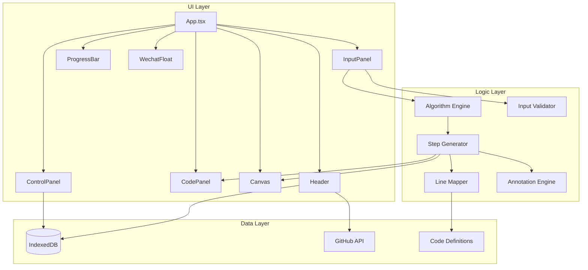

# Design Document

## Overview

本项目是一个基于TypeScript+React+D3.js的LeetCode 128题"最长连续序列"算法可视化演示网站。系统采用单页面应用架构，通过分步动画展示算法执行过程，帮助用户理解算法逻辑。

核心功能包括：
- 多语言算法代码展示与调试模式
- 交互式画布可视化（占页面70%以上空间）
- 动态标注系统（数据流箭头、状态变更标签）
- 详细步骤分镜（每个操作独立步骤）
- 多语言代码行绑定机制
- 分步播放控制
- 数据输入与验证
- GitHub集成与社交功能

## Architecture



## Components and Interfaces

### 1. Header Component
负责页面标题、GitHub徽标和Star数展示。

```typescript
interface HeaderProps {
  // 无需外部props，内部管理状态
}

// 内部状态
interface HeaderState {
  starCount: number;
}
```

### 2. InputPanel Component
负责数据输入、样例选择和随机生成。

```typescript
interface InputPanelProps {
  onDataChange: (data: number[]) => void;
  currentData: number[];
}

interface ValidationResult {
  valid: boolean;
  data?: number[];
  error?: string;
}
```

### 3. CodePanel Component
负责多语言代码展示、语法高亮和变量值显示。

```typescript
interface CodePanelProps {
  stepId: string;                    // 当前步骤ID
  highlightLines: number[];          // 高亮的代码行号（支持多行）
  variables: VariableState;          // 变量状态
  language: CodeLanguage;            // 当前语言
  onLanguageChange: (lang: CodeLanguage) => void;
}

type CodeLanguage = 'java' | 'python' | 'golang' | 'javascript';
```

### 4. Canvas Component
负责D3.js可视化渲染，支持拖动和缩放，展示数据结构、数据流和标注。

```typescript
interface CanvasProps {
  visualization: VisualizationState;
  annotations: Annotation[];         // 动态标注列表
  dataFlows: DataFlow[];            // 数据流箭头列表
  stepDescription: string;          // 步骤描述
}

interface Transform {
  x: number;
  y: number;
  scale: number;  // 范围: 0.5 - 3.0
}
```

### 5. ControlPanel Component
负责播放控制和速度调节。

```typescript
interface ControlPanelProps {
  currentStep: number;
  totalSteps: number;
  playState: PlayState;
  playSpeed: number;
  onPrevious: () => void;
  onNext: () => void;
  onPlayPause: () => void;
  onReset: () => void;
  onSpeedChange: (speed: number) => void;
}

type PlayState = 'playing' | 'paused' | 'stopped';
```

### 6. ProgressBar Component
负责进度展示和拖动跳转。

```typescript
interface ProgressBarProps {
  currentStep: number;
  totalSteps: number;
  onSeek: (step: number) => void;
}
```

### 7. WechatFloat Component
负责微信交流群悬浮球展示。

```typescript
interface WechatFloatProps {
  // 无需外部props
}
```

## Data Models

### AlgorithmStep
表示算法执行的单个步骤，使用StepId进行多语言代码行绑定。

```typescript
interface AlgorithmStep {
  stepId: string;                   // 步骤唯一标识符（如 "init_hashset", "loop_start_0"）
  stepType: StepType;               // 步骤类型
  variables: VariableState;         // 变量状态
  visualization: VisualizationState;  // 可视化状态
  annotations: Annotation[];        // 动态标注
  dataFlows: DataFlow[];           // 数据流
  description: string;              // 步骤描述
}

type StepType = 
  | 'variable_init'      // 变量初始化
  | 'loop_start'         // 循环开始
  | 'loop_iteration'     // 循环迭代
  | 'condition_check'    // 条件判断
  | 'data_operation'     // 数据结构操作
  | 'variable_update'    // 变量更新
  | 'algorithm_end';     // 算法结束
```

### LineMapping
多语言代码行号映射表。

```typescript
interface LineMapping {
  [stepId: string]: {
    java: number[];        // Java代码行号（支持多行）
    python: number[];      // Python代码行号
    golang: number[];      // Golang代码行号
    javascript: number[];  // JavaScript代码行号
  };
}
```

### Annotation
动态标注，用于在画布元素上展示文字说明。

```typescript
interface Annotation {
  id: string;
  type: AnnotationType;
  targetId: string;           // 目标元素ID
  position: 'top' | 'bottom' | 'left' | 'right';
  text: string;               // 标注文本
  highlight?: boolean;        // 是否高亮
}

type AnnotationType = 
  | 'comparison'    // 比较操作（如 "100 == 100? true"）
  | 'assignment'    // 赋值操作
  | 'value_change'  // 值变化（显示前后值）
  | 'iteration'     // 迭代信息（索引、元素值）
  | 'condition';    // 条件判断结果
```

### DataFlow
数据流，表示值从一个位置传递到另一个位置。

```typescript
interface DataFlow {
  id: string;
  sourceId: string;           // 源元素ID
  targetId: string;           // 目标元素ID
  label: string;              // 箭头旁的文字说明
  animated?: boolean;         // 是否动画
}
```

### VariableState
表示算法执行过程中的变量状态。

```typescript
interface VariableState {
  num_set?: number[];
  longestStreak?: number;
  currentNum?: number;
  currentStreak?: number;
  num?: number;
  // 变量变更记录
  changes?: {
    variable: string;
    oldValue: any;
    newValue: any;
  }[];
}
```

### VisualizationState
表示画布可视化的状态。

```typescript
interface VisualizationState {
  originalArray: ArrayElement[];      // 原始数组（带索引和值）
  hashSet: HashSetElement[];          // HashSet数据结构
  highlightedIndices: number[];       // 高亮的数组索引
  currentSequence: number[];          // 当前序列
  longestSequence: number[];          // 最长序列
  isSequenceStart: boolean;           // 是否为序列起点
}

interface ArrayElement {
  index: number;
  value: number;
  highlighted: boolean;
  highlightColor?: string;
}

interface HashSetElement {
  key: number;
  highlighted: boolean;
  highlightColor?: string;
}
```

### CacheData
表示IndexedDB中的缓存数据。

```typescript
interface CacheData {
  stars: number;
  timestamp: number;
}
```

## Correctness Properties

*A property is a characteristic or behavior that should hold true across all valid executions of a system-essentially, a formal statement about what the system should do. Properties serve as the bridge between human-readable specifications and machine-verifiable correctness guarantees.*

### Property 1: 输入验证一致性
*For any* 输入字符串，如果validateInput返回valid=true，则返回的data数组必须满足：长度不超过100，所有元素在-10^9到10^9之间；如果返回valid=false，则必须包含非空的error信息。
**Validates: Requirements 3.6, 3.7**

### Property 2: 随机数据合法性
*For any* 调用generateRandomData生成的数组，其长度必须在5-20之间，所有元素必须在-50到50之间。
**Validates: Requirements 3.5**

### Property 3: 步骤导航边界
*For any* 当前步骤currentStep和总步骤数totalSteps，执行上一步操作后currentStep >= 0，执行下一步操作后currentStep < totalSteps。
**Validates: Requirements 6.2, 6.3**

### Property 4: 播放状态切换
*For any* 播放状态playState，执行播放/暂停操作后，如果之前是'playing'则变为'paused'，如果之前是'paused'或'stopped'则变为'playing'。
**Validates: Requirements 6.4**

### Property 5: 进度条同步
*For any* 当前步骤currentStep和总步骤数totalSteps，进度条位置百分比必须等于currentStep / (totalSteps - 1) * 100。
**Validates: Requirements 7.3, 7.4**

### Property 6: 代码行号映射一致性
*For any* 算法步骤的stepId和任意语言，通过LineMapping查找的代码行号必须是有效行号（1到该语言代码总行数之间），且行号数组非空。
**Validates: Requirements 4.3, 15.2, 15.3**

### Property 7: 变量值展示正确性
*For any* 算法步骤的variables对象，展示的变量值字符串必须正确反映变量的实际值。
**Validates: Requirements 4.4**

### Property 8: 缓存有效期
*For any* 缓存的Star数据，如果当前时间与缓存时间戳的差值小于1小时，则应返回缓存值而不发起新的API请求。
**Validates: Requirements 2.5**

### Property 9: 画布元素不重叠
*For any* 画布上绘制的元素集合，任意两个元素的边界框重叠面积不应超过各自面积的10%。
**Validates: Requirements 5.12**

### Property 10: 颜色无紫色
*For any* 页面中使用的颜色值，其色相值不应在270-330度范围内（紫色色调）。
**Validates: Requirements 9.2**

### Property 11: 缩放范围限制
*For any* 用户缩放操作后的scale值，必须在0.5到3.0之间（包含边界）。
**Validates: Requirements 5.3**

### Property 12: 数据流标签非空
*For any* 生成的DataFlow对象，其label字段必须为非空字符串。
**Validates: Requirements 5.9**

### Property 13: StepId唯一性
*For any* 生成的算法步骤序列，所有步骤的stepId必须唯一且非空。
**Validates: Requirements 15.1**

### Property 14: 多语言映射完整性
*For any* stepId，LineMapping中必须包含java、python、golang、javascript四种语言的映射，且每种语言的行号数组非空。
**Validates: Requirements 15.2, 15.4**

### Property 15: 变量更新记录完整性
*For any* stepType为'variable_update'的步骤，其variables.changes数组必须包含至少一个变更记录，每个记录包含variable、oldValue、newValue字段。
**Validates: Requirements 13.3**

### Property 16: 步骤类型覆盖完整性
*For any* 输入数组生成的步骤序列，必须包含'variable_init'类型的步骤（变量初始化）和'algorithm_end'类型的步骤（算法结束）。
**Validates: Requirements 14.1, 14.6**

## Error Handling

### 输入验证错误
- 空输入：显示"输入不能为空"
- 格式错误：显示"输入格式无效，请输入数字数组，如: [1,2,3] 或 1,2,3"
- 长度超限：显示"数组长度不能超过100"
- 数值超限：显示"数字必须在 -10^9 到 10^9 之间"

### API请求错误
- GitHub API失败：静默降级，使用缓存值或默认值0
- 网络错误：不影响核心功能，仅Star数显示为缓存值

### IndexedDB错误
- 数据库打开失败：使用默认值
- 读写失败：静默忽略，不影响用户体验

## Testing Strategy

### 单元测试
使用Vitest进行单元测试，覆盖以下模块：
- 输入验证函数 `validateInput`
- 随机数据生成函数 `generateRandomData`
- 算法步骤生成函数 `generateAlgorithmSteps`
- 代码行号映射函数 `getLineNumbers`
- 标注生成函数 `generateAnnotations`
- 数据流生成函数 `generateDataFlows`
- 缓存操作函数

### 属性测试
使用fast-check进行属性测试，验证以下属性：
- 输入验证的一致性和完整性（Property 1）
- 随机数据生成的合法性（Property 2）
- 步骤导航的边界条件（Property 3）
- 播放状态切换的正确性（Property 4）
- 进度条同步的准确性（Property 5）
- 代码行号映射一致性（Property 6）
- 缩放范围限制（Property 11）
- 数据流标签非空（Property 12）
- StepId唯一性（Property 13）
- 多语言映射完整性（Property 14）
- 变量更新记录完整性（Property 15）
- 步骤类型覆盖完整性（Property 16）

### 集成测试
使用Playwright进行端到端测试：
- 页面加载和渲染
- 用户交互流程
- 键盘快捷键
- 画布拖动和缩放
- 多语言切换
- 数据流箭头和标注展示

### 测试配置
- 属性测试最少运行100次迭代
- 每个属性测试必须标注对应的设计文档属性编号
- 测试标注格式：`**Feature: algorithm-visualizer, Property {number}: {property_text}**`
