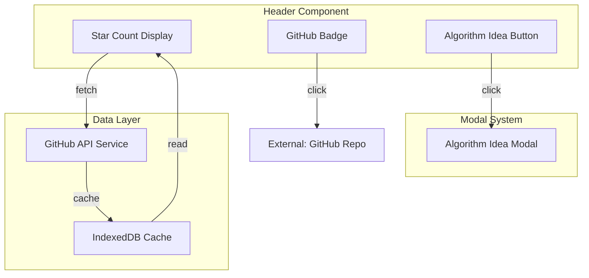

# Design Document

## Overview

本设计文档描述了为算法可视化应用 Header 组件添加 GitHub 徽标（含 Star 数缓存）和算法思路按钮的实现方案。该功能增强了用户体验，让用户可以快速访问项目仓库、了解项目热度，并在可视化过程中随时查看算法解题思路。

核心功能：
- GitHub 徽标：位于右上角，点击跳转仓库，悬停显示提示
- Star 数显示：使用 GitHub API 获取，IndexedDB 缓存1小时
- 算法思路按钮：位于 GitHub 徽标左侧，点击弹出模态框展示解题思路

## Architecture



## Components and Interfaces

### 1. Header Component (修改现有)

```typescript
// src/components/Header/Header.tsx
interface HeaderProps {
  // 无需额外 props，使用内部状态管理
}

// 内部状态
interface HeaderState {
  starCount: number;
  isModalOpen: boolean;
}
```

### 2. AlgorithmIdeaModal Component (新建)

```typescript
// src/components/AlgorithmIdeaModal/AlgorithmIdeaModal.tsx
interface AlgorithmIdeaModalProps {
  isOpen: boolean;
  onClose: () => void;
}
```

### 3. GitHub Service (新建)

```typescript
// src/services/githubService.ts
interface GitHubService {
  getStarCount(): Promise<number>;
}

// 常量配置
const GITHUB_REPO_URL = 'https://github.com/fuck-algorithm/leetcode-128-longest-consecutive-sequence';
const GITHUB_API_URL = 'https://api.github.com/repos/fuck-algorithm/leetcode-128-longest-consecutive-sequence';
const CACHE_DURATION = 60 * 60 * 1000; // 1小时
```

### 4. IndexedDB Cache Interface (使用现有)

```typescript
// src/utils/indexedDB.ts (已存在，可能需要扩展)
interface StarCache {
  stars: number;
  timestamp: number;
}

// 已有函数
getStarCache(): Promise<number | null>;
saveStarCache(stars: number): Promise<void>;
isStarCacheValid(): Promise<boolean>;
```

## Data Models

### Star Cache Data Model

```typescript
interface StarCacheData {
  key: 'github-stars';
  value: {
    stars: number;      // Star 数量
    timestamp: number;  // 缓存时间戳 (Date.now())
  };
}
```

### Algorithm Idea Content

```typescript
interface AlgorithmIdea {
  title: string;           // 算法标题
  problemDescription: string; // 问题描述
  approach: string;        // 解题思路
  timeComplexity: string;  // 时间复杂度
  spaceComplexity: string; // 空间复杂度
  keyPoints: string[];     // 关键点
}

// 最长连续序列算法思路
const longestConsecutiveIdea: AlgorithmIdea = {
  title: '128. 最长连续序列',
  problemDescription: '给定一个未排序的整数数组 nums，找出数字连续的最长序列的长度。',
  approach: `
    1. 使用 HashSet 存储所有数字，实现 O(1) 查找
    2. 遍历 HashSet 中的每个数字
    3. 对于每个数字，检查它是否是序列的起点（即 num-1 不在集合中）
    4. 如果是起点，向后查找连续的数字，计算序列长度
    5. 更新最长序列长度
  `,
  timeComplexity: 'O(n)',
  spaceComplexity: 'O(n)',
  keyPoints: [
    '使用 HashSet 实现 O(1) 查找',
    '只从序列起点开始计数，避免重复计算',
    '每个数字最多被访问两次（一次遍历，一次序列扩展）'
  ]
};
```


## Correctness Properties

*A property is a characteristic or behavior that should hold true across all valid executions of a system-essentially, a formal statement about what the system should do. Properties serve as the bridge between human-readable specifications and machine-verifiable correctness guarantees.*

Based on the prework analysis, the following correctness properties have been identified:

### Property 1: Cache validity determines data source

*For any* StarCache entry with a timestamp, the cache is considered valid if and only if `(currentTime - timestamp) < CACHE_DURATION (1 hour)`. When valid, the cached value SHALL be returned without API call; when invalid, the system SHALL fetch from API.

**Validates: Requirements 2.2, 4.2**

### Property 2: Successful API response triggers cache save with timestamp

*For any* successful GitHub API response returning a star count, the system SHALL save both the star count value and the current timestamp to IndexedDB cache.

**Validates: Requirements 2.4, 4.1**

### Property 3: API failure with existing cache returns cached value

*For any* GitHub API failure scenario where IndexedDB cache contains a previous star count (regardless of expiration), the system SHALL return the cached star count value.

**Validates: Requirements 2.5**

### Property 4: Cache data round-trip consistency

*For any* valid StarCache object `{ stars: number, timestamp: number }`, serializing to IndexedDB and then deserializing SHALL produce an equivalent object with identical `stars` and `timestamp` values.

**Validates: Requirements 4.3, 4.4**

## Error Handling

### GitHub API Errors

| Error Scenario | Handling Strategy |
|----------------|-------------------|
| Network failure | Return cached value if exists, otherwise return 0 |
| API rate limit (403) | Return cached value if exists, otherwise return 0 |
| Repository not found (404) | Return cached value if exists, otherwise return 0 |
| Server error (5xx) | Return cached value if exists, otherwise return 0 |

### IndexedDB Errors

| Error Scenario | Handling Strategy |
|----------------|-------------------|
| IndexedDB not supported | Silently fail, always fetch from API |
| Read error | Return null, trigger API fetch |
| Write error | Silently fail, continue without caching |
| Database upgrade needed | Handle in onupgradeneeded callback |

### Modal Errors

| Error Scenario | Handling Strategy |
|----------------|-------------------|
| Content not found | Display fallback message |
| Render error | Close modal gracefully |

## Testing Strategy

### Property-Based Testing

使用 **fast-check** 作为属性测试库（与项目现有的 vitest 测试框架兼容）。

每个属性测试配置运行 **100 次迭代**。

属性测试标注格式：`**Feature: github-badge-algorithm-idea, Property {number}: {property_text}**`

#### Property Tests to Implement

1. **Cache Validity Property Test**
   - Generate random timestamps (past, present, future relative to cache duration)
   - Verify validity check returns correct boolean
   - Verify correct data source is used based on validity

2. **Cache Save Property Test**
   - Generate random star counts (0 to 1,000,000)
   - Verify save operation stores both value and timestamp
   - Verify timestamp is within acceptable range of current time

3. **API Failure Fallback Property Test**
   - Generate random cached values
   - Simulate API failure
   - Verify cached value is returned

4. **Round-Trip Property Test**
   - Generate random StarCache objects
   - Serialize then deserialize
   - Verify equality of original and result

### Unit Tests

1. **Header Component Tests**
   - Renders GitHub badge with correct link
   - Renders star count display
   - Renders algorithm idea button
   - Tooltip displays on hover
   - Modal opens on button click

2. **AlgorithmIdeaModal Tests**
   - Renders when isOpen is true
   - Does not render when isOpen is false
   - Displays algorithm content correctly
   - Closes on backdrop click
   - Closes on close button click

3. **GitHub Service Tests**
   - Returns cached value when valid
   - Fetches from API when cache expired
   - Handles API errors gracefully
   - Returns default 0 when no cache and API fails

### Integration Tests

1. **Full Flow Test**
   - Component mounts → fetches star count → displays correctly
   - Cache expires → refetches → updates display
   - API fails → shows cached value
